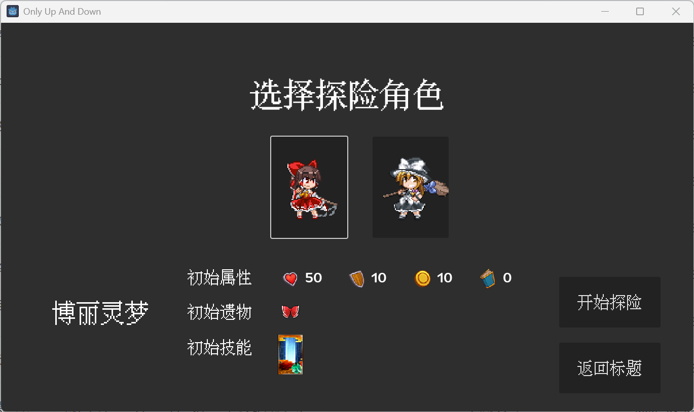

# Only Up And Down: Touhou Roguelike Game
  
Only Up And Down is a roguelike game made with Godot engine. 
## Concept
* Select a hero and explore the randomly generated dungeons.
  
* The only decision you can make is to move up or down.
  
* Collect different spells and artifacts!
  
* Different heroes, spells, artifacts, enemies and items are in the game.
  
## Credits & Assets
* This is a touhou-project fan game. Main resources are from [東方二次創作RPG 幻想人形演舞](http://www.fo-lens.net/gn_enbu/).
* The concept of the game is inspired from [RIght and Down](https://store.steampowered.com/app/2008050/Right_and_Down/).
